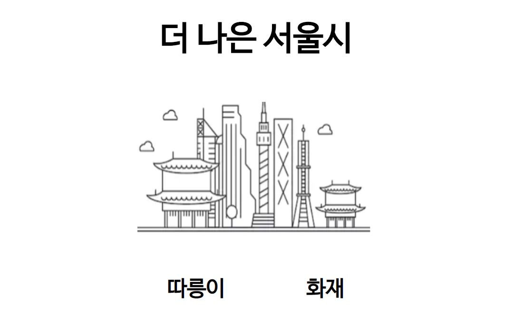
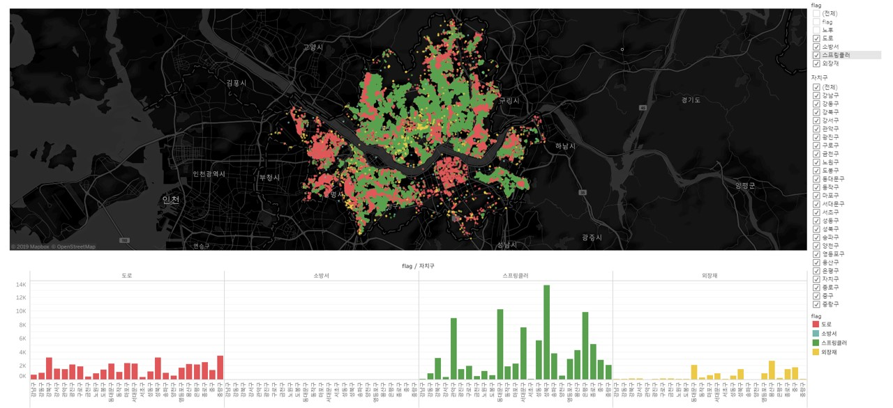
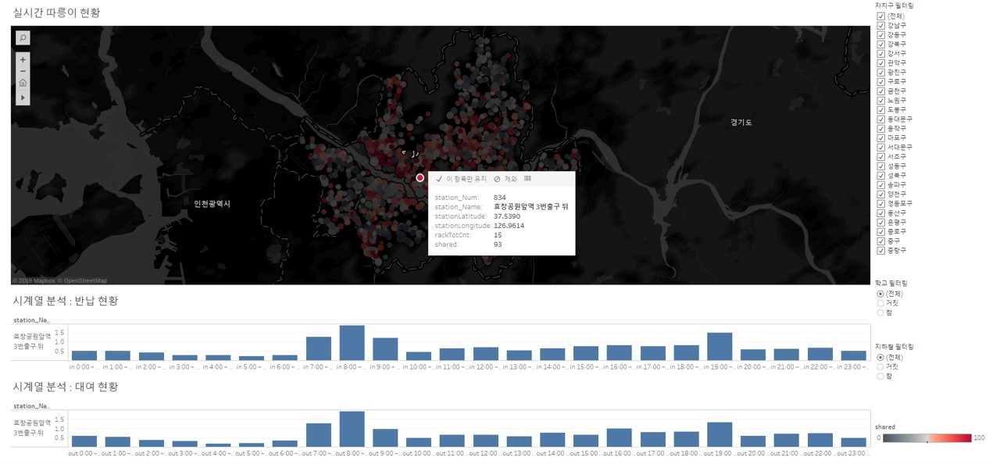

# 더 나은 서울시 

## 프로젝트 소개

교통 (따릉이) / 안전(화재) 두 분야의 데이터를 사용하여

데이터 분석과 시각화를 통해 서울시의 문제 현황 분석

문제점 파악 후 서울시가 개선해야 할 부분 제시

## 프로젝트 페이지
### https://kimseokyeung.github.io/opensourceproject/

----

## 프로젝트 구성
- 사용 툴
	- Python
	- Jupyter Notebook
	- NumPy
	- Pandas
	- GeoPandas
	- Atom 
	- QGIS 
	- JSON 
	- REQUESTS

----

## Load DataSet

### 서울특별시  공공자전거 실시간 대여정보 API : 실시간 따릉이별 거치대 거치율 정보
http://openapi.seoul.go.kr:8088/5058644a58646c733132324e6448695/json/bikeList/1/1000
http://openapi.seoul.go.kr:8088/5058644a58646c733132324e6448695/json/bikeList/1001/2000

### 대용량 데이터(100MB 이상)는 git에 upload가 불가능하여 google cloud에 upload
[따릉이분석 사용 데이터 파일] 

https://drive.google.com/drive/folders/1bw3jGen8kC6ueqafPqyaRSTS3QtVU4Df?usp=sharing 

[화재 취약지역 분석 seoul.shp 파일] 

https://drive.google.com/drive/folders/1_iE_MgjzaqWf7nhmS-BkPsNVB54ywSi6?usp=sharing

